# * means important

# *计算机安全基本概念

计算机安全就是为计算系统(硬件、软件、存储介质数据以及执行任务的人的集合) 建立和采取的技术和管理的安全保护，保护其机密性、完整性和可用性。

## 计算机安全的特点

- 没有绝对的安全
- 安全是一个动态实践的过程，安全问题的解决，必须重视整体系统结构的规划和安全策略的指定
- 人是安全机制中最薄弱环节

## *安全属性CIA

- 机密性confidentiality：对信息或资源的隐藏，使得信息不被未授权者访问
- 完整性：网络中传输的信息数据必须保持初始状态，没有第三方能够修改数据内容、所有资源只能由授权方或以授权的方式进行修改。**保证收到的数据是授权实体所发出的数据**

- 可用性：所有的资源在适当的时候可以由授权方访问。备份、资源冗余、灾难恢复等方式保证

其他

- 真实性：保证信息的真实性，包括实体身份的认证、消息源的认证

- 不可否认性：防止任一通信实体否认行为

  当发方发送信息时，收方能够证明信息源合法。当收方接到信息时，发方能够证明信息目的地合法

  源不可否认：向数据收到者提供数据源的证据（即发方的签名），可防止发送者否认发送过这个数据

  宿不可否认：向数据发送者提供数据已交付给接收者的证据（即接收方的回执），可防止接收者事后否认曾收到过次数据

## *威胁：

- 外因 计算机病毒，黑客
- 内因：系统在设计、实现和管理中的缺陷。如软件漏洞、IPV4协议没有考虑安全性、缺省安装、弱口令

威胁发起者：业余爱好者，激进黑客，有组织的犯罪团伙，国家资助的黑客和恐怖组织

- 业余爱好者：脚本小子，没啥技能，用的是现有工具
- ***激进黑客**
  - 白（正义）、黑（非法获取个人、经济、政治利益）、灰帽（介于两者之间。）

## 攻击描述和防御框架

### 安全攻击实施**方式**：

- **技术**：通过专门设计的攻击工具或利用计算机系统的薄弱点进行攻击。
- **社会工程学方式**：非技术手段获得未经授权的访问

### *安全攻击分类

- **主动攻击**：试图改变系统资源或影响其运行
  - 篡改：修改数据，破坏系统和数据的完整性
    - 一个非授权方不仅介入系统并且在系统中瞎捣乱的攻击，破坏完整性
    - 这些攻击包括改变数据文件，改变程序使之不能正确执行，修改新建内容等
  - 重演：捕获一个数据单元，在以后的某个时机重传
  - 伪造：假冒另一个实体发送信息。破坏真实性
  - 拒绝服务：通过耗尽目标系统的资源，危害目标系统的正常使用
- **被动攻击**：试图从系统中学习、或者利用系统信息，但不影响系统资源
  - 窃听
  - 流量分析

***受攻击面：攻击者可访问的给定系统中所有漏洞的集合**

- 如：服务器或者主机上的开放端口
- 如：面向互联王的服务器上运行的软件
- 如：无线网络协议甚至用户

***攻击面分类**

- 网络受攻击面
- 软件受攻击面
- 人类受攻击面

**攻击树**

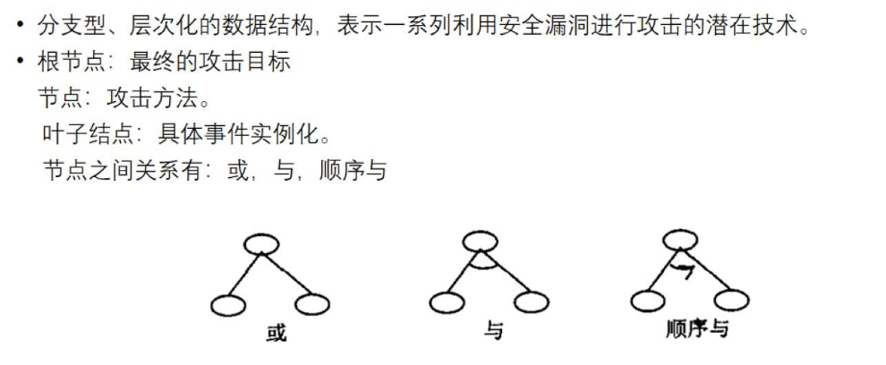

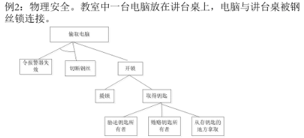

## **纵深防御的概念**

>定义:通过设置多层重叠的安全防护系统而构成多道防线，使得即使某一防线失效也能被其他防线弥补或纠正。
>分类:安全洋葱法、安全洋蓟法

### ***安全洋葱法Security Onion**

- 是一种**有边界**、分层次的安全纵深防御方法

- 威胁发起者必须以类似于剥洋葱的方式剥掉网络的防御机制

### ***安全洋蓟法Security Artichoke**

- 是一种**无边界**网络安全的纵深防御方法

- 威胁发起者不需要剥掉每一层，只需去掉某些“洋蓟叶子"，就可到达洋蓟的中心，直击企业的“心脏"。

## 评估准则

安全评估准则

- 可信计算机系统评估准则TCSEC (Trusted Computer Security EvaluationCriteria)

- 信息技术安全评估准则ITSEc (Information Technology SecurityEvaluation Criteria )

- 信息技术安全评价通用准则cc (Information security common criteria)

**TCSEC（桔皮书）**

TDI（紫皮书）

TNI（红皮书）

**ITSEC（欧洲白皮书）**

==要记住D级 C2 B1==

TCSEC的缺点

- 静态模型。TCSEC针对孤立计算机系统，特别是小型机和主机系统，只考虑保密性。
- 美国国家计算机安全中心NCSC的TNI把TCSEC的思想用到网络上，但缺少成功实践的支持。
- TCSEC模型不能适应计算机发展的规律。

==我国颁发的《计算机信息系统安全保护等级划分准则》,将计算机安全保护划分为**5个级别。**==

## 安全原则

- 最易渗透

  入侵者总是企图利用任何可能的入侵手段

  受否安全，必须考虑所有可能的入侵方式

- 适度保护

  被保护的程度与价值一致

- 有效性保护

  控制措施高效，易使用，适当

  控制使用不影响被保护任务

- 最弱环节

  绝对安全措施的强度

## 安全设计原则

- 经济机制

  嵌入在软硬件中的安全机制设计要简单、短小

- 安全缺省设置

  访问控制基于许可，默认条件=deny 默认不信任

- 绝对中介

  安全仲裁

- 开放式设计

  接收广泛的公开审查

- 特权分离和最小特权

  

- 最小公共机制

- 心理可接受性

  安全机制不应该过度干涉用户的工作，同时也要满足用户授权访问的要求。

  易用性，能促进广泛采用

- 隔离

- 封装

- 模块化

通过对系统功能或数据的不利修改对系统运行进行非期望的改变导致的威胁后果是破坏

敏感数据被直接泄露给非授权实体导致的威胁后果是非授权泄露

中间人攻击涉及说服用户和访问点相信他们正在互相交谈,而实际上通信正在通过中间攻击设备。

OSI安全体系结构专注于安全攻击,机制/安全机制和服务。

# 密码

公元前400年古希腊人发明斯巴达密码棒Scytale 密钥就是特定直径的棒

凯撒密码中,每个字母被其后第几位的字母替换?(3)

## 古典算法

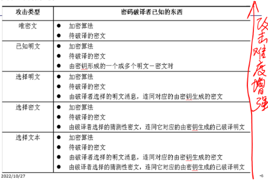

1)唯密文攻击

通过统计特性分析规律，猜测分析得出明文

比如按照频率

2)已经明文攻击

已知一些过去的明文-密文对，用以参考或者启发。推导出某些关键词，从而得到密文信息的部分内容。

可能字/概率字攻击

比如，知道密文是从哪个部门发出的(参谋部、电台、后勤部等)，破解成功率会加大。
可能字/概率字攻击:
通过某些特定信息可以推知信息的部分内容。加密的计算机程序文件:获取到的密文数据以标准词“LOGIN”开头诸如”BEGIN”、”END”、”IF”、”THEN”、”ELSE”等词的密文有规律地在密文中出现。攻击者可合理猜测它们是计算机程序文件。加密的数据库文件:数据库文件密文的字段和取值往往具有规律性，如学生成绩数据库文件一定会包含诸如姓名、学号、成绩等字段，且成绩的取值范围在0-100之间。攻击者也可以合理猜测它们。

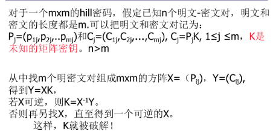

3)选择明文攻击

随意选择特定的，最有可能恢复出密钥的明文块去加密，得到密文快或者密文数据库以此推测出密钥

例如: 使用某种算法用大量不同密钥加密“你好”等常用术语，生成一个特定的密文数据库。之后，只要获取到的密文在密文数据库中，就可以找到明文。相当于知晓了密钥。

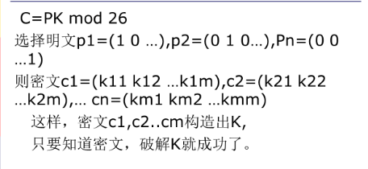

### 代换

明文中每一个字符被替换成密文中的另外一个字符。

- 单字母，凯撒Caesar密码
- 多字母，**Playfair Hill**

https://baike.baidu.com/item/playfair%E5%AF%86%E7%A0%81/8999814 

最后编写密文。对明文加密规则如下：

1 若p1 p2在同一行，对应密文c1 c2分别是紧靠p1 p2 右端的字母。其中第一列被看做是最后一列的右方。

2 若p1 p2在同一列，对应密文c1 c2分别是紧靠p1 p2 下方的字母。其中第一行被看做是最后一行的下方。

3 若p1 p2不在同一行，不在同一列，则c1 c2是由p1 p2确定的矩形的其他两角的字母（至于横向替换还是纵向替换要事先约好，或自行尝试）

**Hill**

### 置换算法

通过对明文字母的置换，密文为一种类型完全不同的映射

**就是打乱排序**

### 多重加密

### 隐写术

除密码学外的另一种隐藏信息存在的技术，将信息隐藏到其他信息中。

隐藏方式:

- 用—整段信息中单词或字母的子集来表达隐含信息
- 用不可见的墨水
- 藏在图像或声音文件中

## 对称密码算法

定义：加密和解密使用的密钥是相同的，算法的安全性依赖于密钥

分类

- 流密码：一次只对明文中的一位或者一个字节进行加解密
- 分组密码：对固定长度的明文块进行加密解密

### 分组密码的基本设计

混乱：基于代换操作实践，非线性变换，密文和密钥（或者明文）之间的函数关系尽量复杂

扩散：基于置换，线性变换，将明文的统计特诊和结构规律分散到密文中

#### 基本结构设计

##### SPN

n比特明文经过多重代换-置换迭代得到n比特密文

每一次迭代的操作：异或运算，分组代换，单比特置换

**AES**采用这个结构

##### Feistel

另一种多重代换-置换网络

大多数重要对称分组加密算法采用的结构。如**DES算法**

- 将明文分为两半，经过多轮处理后合成为密文组
- 每轮
  - 对左半数据进行一次代换：将右半数据和本轮密钥做F函数的映射，再将结果和左半数据进行异或，得到新的左半数据
  - 将左右两半进行置换操作

**SDES**

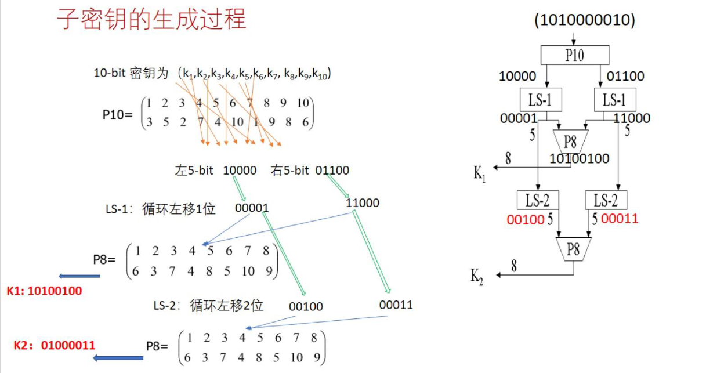

图片中P8操作。下面的那行没有1和2表示第一和第二被舍弃。==实际上P8下一行对应的是原来那十个数中的位数，不用看第一行，直接对应第二行就行==

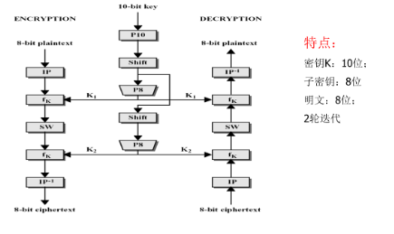

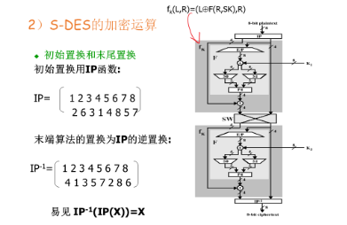

### 常用的对称算法

#### 三种分组密码

### 两种流密码

- 软件优化加密算法(SEAL):一种使用160位加密密钥的流密码。.

- Rivest 流密码(RC)系列算法（包括RC2、RC4、RC5 和 RC6）

  - RC4 流密码算法广泛应用于SSL/TLS协议和 WEP/WPA 无线局域网认证协议，速度可以达到DES加密的10倍左右。

  - RC2,RC5,RC6为分组密码。

    - RC2可作为DES算法的建议替代算法，输入和输出都是64比特，密钥的长度是从1字节到128字节可变。

    - RC6是RC5的改进算法。

## 密码工作模式

### 电码本ECB

简单、有效、可并行

没有误差传递现象

不能隐藏明文的模式信息，只适合短消息传输

明文易收到主动攻击

### 密文分组链接CBC

解决ECB的缺陷：相同明文分组，不一定密文分组相同

应用场景：传输长度大于64位的报文，消息认证

CBC存在误差传递

- 如一个CBC密文分组损坏
  - 密文分组长度不变：解密时，最多影响2个明文分组
  - 变化时有比特缺失：会影响后续的所有

### 密文反馈CFB

CFB-1：流明文Pi是1bit

CFB-8：流明文Pi是8bit

CFB-64：流明文Pi是64bit

无论加密还是解密，CFB只有分组加密算法

CFB是一种使用分组密码实现流密码的方式

存在误差传递

### 输出反馈OFB

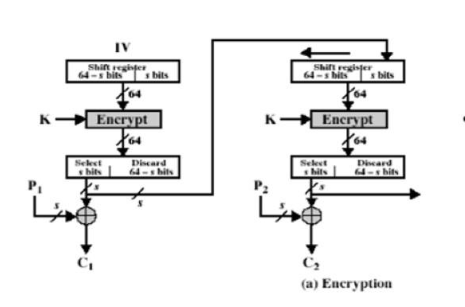

无误差传递

### 计数器CTR

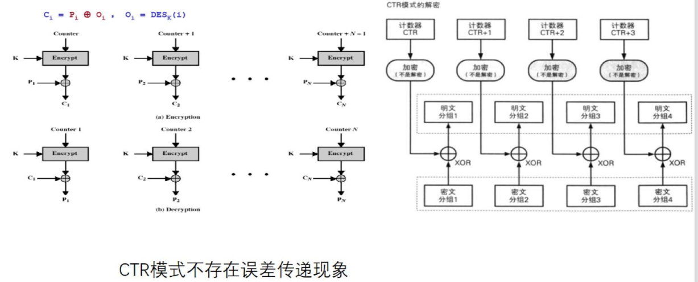

## 公钥密码

对称密码的问题

- N个用户通信，需要需要密钥个数N(N-1)/2
- 不能用于数字签名（身份认证）

加密和解密使用不同的密钥完成

私钥：不公开，可用来签名

公钥：公开，用来验证签名 

N个用户需要2N个密钥

知道加密算法，从加密密钥得到解密密钥上计算上不可行

### 数学基础

完整的剩余类:对数进行模n算术运算时，相同余数（如0,1..n-1 )
在一个类中，共有n个剩余类
剩余的约化集:剩余类中与n互素的那些剩余类。
Euler函数:剩余的约化集中，集合元素的个数。即所有小于n的且与n互素的正整数的个数，记为Ф(n)。

素数的本原根定义:如果a是素数n的本原根，则数 a mod n, a2 mod n, .…, an-1 mod n 是不同的并且包含1到n-1的整数的某种排列。

离散对数

求幂的逆向问题就是找到一个数模p的离散对数

y≡a^x^ mod p 则x≡ log~a~ y mod p

仅当a是p的本源根时，才存在唯一的、以a为底 模p的y的离散对数x

加法逆元(x+y)mod n=0

乘法逆元(x*y)mod n=1

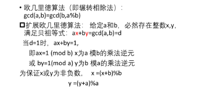

### RSA算法

收发双方均已知n，发送方已知e，接收方已知d，其中: n=pq, p和q是不相等素数，n通常为1024位二进制数或309位十进制数。

RSA密钥创建过程:

- Ф(n)=Ф(pq)=(p-1)(q-1)

- 2)任选一个e,1< e < Ф(n),且与Ф(n)互素

- 3）求d,1< d< Ф(n),且ed是模Ф(n)的乘法逆元 ed=1(mod Ф(n))得到:公钥KU= {e,n}，私钥KR= {d,n}

- 假设明文分组m，密文分组c，加解密过程:加密:c=m^e^ mod n解密:m=c^d^mod n

  加解密算法相同,仅仅使用的密钥不同

两个密文c1和c2相乘后得到的新密文c就是明文m1×m2的密文c
选择密文攻击:如果用户选择一些密文以及它们对应的明文，就可得到密文相乘以后的密文所对应的明文。

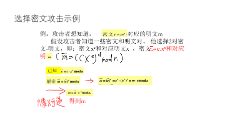

若： **A \* B = C mod n** 
则 ：**A^d ∗ B^d=C^d mod n**

同态加密在云计算中的示例

1. 用户对数据加密，然后上传给云端
2. 用户向cloud提交数据处理方法f
3. cloud在f下处理数据，然后返回给用户
4. 用户在解密

## 公钥管理

### 公钥的分发

- 用户公开发布。用户分发公钥，或在一定范围内广播
- 公开可访问目录 由可信组织维护目录，公钥易伪造或者篡改
- 公钥授权：公钥授权中心分发公钥 ，防伪造，授权中心是瓶颈
- 公钥证书 防伪造，离线分发

### 对称密钥分发

#### 两种算法：

- 通过秘密信道分发

  - 采用对称加密算法
  - 采用公钥算法

- 通过公开信道

  Diffie-Hellman密钥交换算法

#### 数字信封

对称密钥加密明文，然后用接收方的公钥加密自己的对称密钥，然后和加密后的明文组合在一起形成密文。

接收方将加密后的密钥用接收方的私钥解密，然后用这对称密钥解密密文

基于对称密码算法的Needham-Schroeder协议

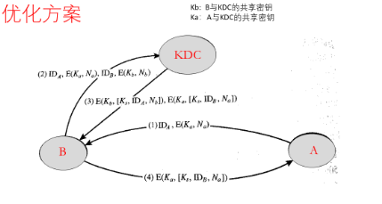

Diffie-Hellman密钥交换算法

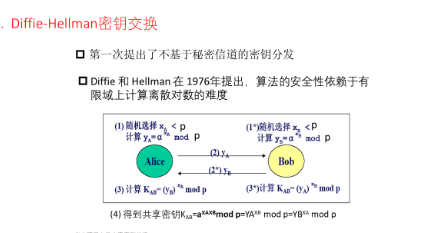

用户Alice和Bob想交换密钥:

约定素数P=353和本原根a=3

随机选择密钥:
-Alice选择X~A~=97,Bob选择X~B~=233计算公钥:

Y~A~=3^97^ mod 353 = 40 (Alice) 

Y~B~=3^233^ mod 353 = 248 (Bob)

计算共享的会话密钥:
K~AB~= y~B~^XA^ mod 353 = 248^97^ = 160 (Alice)

K~AB~= y~A~^XB^ mod 353 = 40^233^ = 160 (Bob)

# 认证理论和技术

## 消息认证

确保消息传输的完整性

伪装:从一个假冒信息源向网络中插入消息

内容篡改:消息内容被插入、删除、变换、修改

顺序修改:插入、除或重组消息序列

时间修改:消息延迟或重放

三类：

- 消息加密函数，对整个消息加密，生成的密文作为认证标示
- 消息认证码(Message Authentication Code): 对消息和密钥进行函数运算，生成固定长度值作为认证标示
- 哈希函数：将任意长度消息映射为一个固定长度的哈希值，作为认证标示，不使用密钥

### 消息加密函数

1.

提供保密和一定消息认证

就是加解密明文的过程

A->B如何判断密文的合法性

- 如果密文有某种语法特征，或者一定的结构特征，B加密后可以认证
- 如果M是随机二进制序列，B无法判断合法性

2.

A给B发：

​	根据明文M生成F，将MF组合在一起，加密

B收到A：

​	解密获得M，计算F’，然后与F比较

类似检错码

3.

公钥加密实现认证

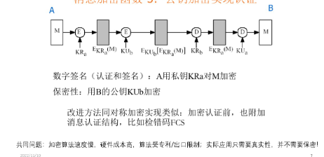

### 消息认证码函数

MAC=C~k~(M)

M：变长的消息

MAC：定长的消息认证码

K：共享的密钥

不需要可逆性

MAC函数，消息和mac长度不相同

加密函数，明文和密文长度相同

MAC 应用

发送方：根据M和K1生成MAC然后和M合在一起用K2加密

接收方：用K2机密获得M和MAC，用K1生成MAC‘与MAC比较

MAC的安全性

n-bit MAC 2^n^个可能的MAC

K-bit 密钥：有2^k^个可能的密钥，对应2^k^个可能的MAC

N>>2^n^

同一MAC可能对应不同的消息---->

伪造消息，
M和M’计算得到相同MAC，通过认证。

获得同一个正确MAC的攻击代价为min (2^k^，2^n^)

### 数据认证算法DAA

### 基于密码的消息认证码CMAC

## 消息摘要函数

hash

输入任意长度的消息M，出一个固定长度m(如m-128或160)的散列 (消息摘要)、计算不可逆。

和MAC码不同，Hash码不使用密钥，是所有消息位M的函数。

不同消息的MAC值可以相同，但不同消息的hash值很难和同(也有相同的可能性)。可以代表原始数据的特征。

可以代表原始数据的特征。 
提供错读检测能力:消息中的任何一位或多位的变化部将导致该散列值的变化.即使变化非常小，也可引起消息摘要的很大变化，产生雪崩效应

主要用在一些只需加密不需解密的场合:如验证数据的完整性、口令表的加密、数字签名、身份认证等。

Hash值长度为m位，攻击代价位2^m/2^(抗强碰撞性)

生日悖论攻击：找到两条消息，他们hash值相等的概率大于0.5的代价为2^m/2^

MD4 vs MD5

MD5：四次循环，每次16步 MD4：三次循环，每次16步

SHA 算法

### 基于密钥hash函数的MAC算法

对密钥和消息进行hash

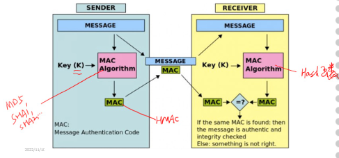

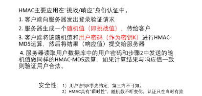

消息认证保护通信双方的数据交换不受第三方的攻击

但不能保证双方自身的相互攻击和欺骗

数字签名可以用来防范通信双方的相互攻击

## 数字签名

数字签名算法（DSA）DSA是生成公钥和私钥对以及生成和验证数字签名的最早标准

RSA：一种对称算法，通常用于生成和验证数字签名

椭圆曲线数字签名算法ECDSA

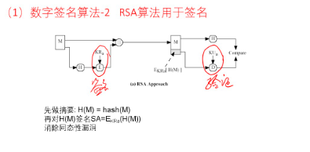

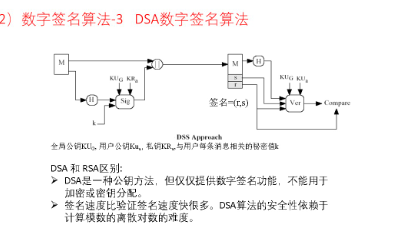

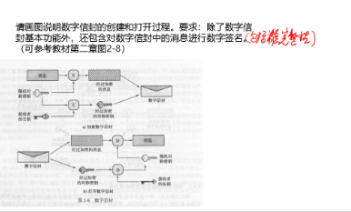

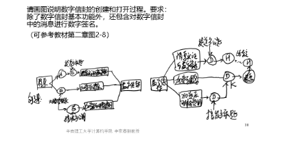

## Kerberos

是MIT的Athena计划中的认证服务协议，为其他AAA协议(Radius)提供认证机制

设计目标包括:

- 认证(authentication)
- 授权 (Authorization)
- 记账审计(acoounting)

在分布式环境中。Kerberos提供集中的认证服务来负责服务器和客户端之间的相互认证
Kerberos是win2000以上系统默认的网络身份验证协议

几个概念

- 两个票据
  - 票据许可票据
  - 服务许可票据
- 两个服务器
  - 认证服务器 AS
  - 票据许可服务端TGS

AS和TGS组成Kerberos服务器

AS的中央数据库中存储所有用户的口令 AS负责给用户发放访问TGS的票据许可票据TGT

TGS则给用户发放访问应用服务器v的服务许可票据

同个用户访问同一种服务，只需要发放一次服务票据

有交互的角色共享会话密钥 大多已按照Needham-Schroeder协议进行了安全的分发

1.用户C用Kc向AS

特点：

- 利用对称密码技术
- 基于口令，将用户命令加密后作为会话密钥
- 应用于分布式环境

缺点：

AS和TGS集中管理，成为系统安全和性能的瓶颈

基于口令的认证，服务器没有验证用户的真实性，如果攻击者记录申请回答报文，容易形成明文-密文间所有可能变换的电码本ECB攻击

N个用户要N(N-1)/2

## X.509公钥证书

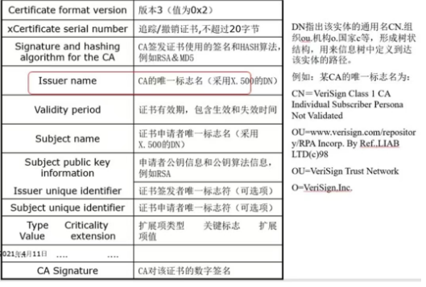

交叉认证

- 始构模型:A间谈此信任，每对CA交叉认证,互发证书。每个CA日录入口中包含阿科证书: 1)向前证书:由其他CA发给X的证书;2) 向后证书: X发给其他CA的证书

层次认证

结构模型:一棵倒特的树，祖在顶上，树技向下忡展，树叶在下面。 根CA [节点)作为任的恨或”信任锚”，中间节点是0层或n层的了CA，树叶节点为终端用户

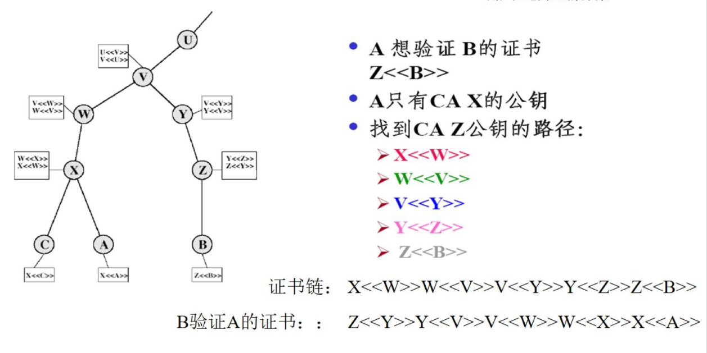

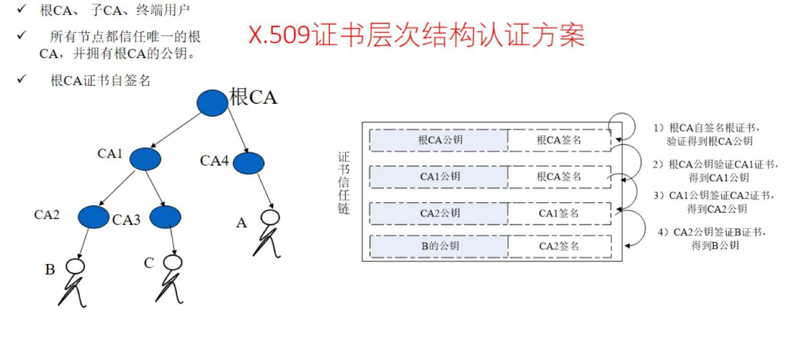

## SSL

## PKI

# 软件安全

## 缓冲区溢出

大量的输入被放置到缓冲区或数据存储区，超过其所分配的存储能力，覆盖其他信息。攻击者利用这样的状况破坏系统或插入特别编制的代码以获得系统的控制权。

T0：漏洞被发现点

T1：漏洞信息发布点

T2：漏洞被修补点

0-day：已经被发现（未被公开），而官方还没有相关补丁的漏洞，攻击有效性最强

1-day：刚公布后的漏洞，或公布后未打补丁的漏洞，攻击有效性较好

2-day：公布很久，流传很广的漏洞，攻击有效性随时间大幅下降

溢出原因：

- 冯洛伊曼体系结构中的代码和数据混合存储,没有严格区分用户数据和程序控制指令
- 部分编程语言（如C、C++)具有直接访问内存的能力。

### shellcode

指发生缓冲区溢出攻击时，程序的执行被转移到攻击者提供的、保存在发生溢出的缓冲区中的代码，是机器代码，依赖特定的处理器结构（特定的操作系统)。

特点
1）代码内容中不包含绝对地址，必须为浮动地址。不可能预先准确定位。
2）代码中不能包含NULL字符。空字符为串结束符, shellcode内部含有null字符将使代码不完整。
3）代码短小，以便能填入buffer

### NOP

- 解决不能准确定位shellcode代码初始地址问题。
- 在攻击代码ShellCode前包括若干NOP指令，如果指针指向NOP,执行将继续往下直到获得攻击代码。
- 攻击者只要指定的ret地址在这些NOP指令所在的存储单元地址中，最终就可以执行shellcode。

## 缓冲区利用

实现缓冲区溢出攻击步骤
1．寻找脆弱性函数

2．发现有缓冲区溢出漏洞的代码

3．设计一个可被执行的漏洞或攻击点程序shellcode

4．设置Return指针,以便能被指回进入执行堆栈

### Ret2Libc  return to libc

从软件及其依赖库借库函数， 比如, system() . exec()、mprotect()函数

在栈中准备好库函数的参数和首地址

溢出时修改函数的返回地址

### ROP return oriented programming

代码段串起来。

### 指针欺骗

### 整数溢出

### Metasploit

## 预防方法

使用安全语言和库函数

DEP数据执行保护

Canary堆栈溢出检查

ASLR地址空间布局随机化

# 网络安全

防火墙：访问控制

防火墙规则设计原则

# 操作系统

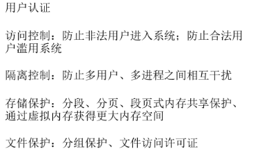

## 安全机制

### 访问控制

三要素

- 主体：访问操作系统的主动发起者
- 客体：信息的载体，接收信息的实体
- 安全访问规则：客体对主体的条件约束

### 隔离控制

逻辑隔离，虚拟内存技术，虚拟机技术

### 用户认证

### 文件保护

### 存储保护

## 安全内核

- 覆盖性
- 隔离性
- 统一性
- 可修改性
- 紧凑型
- 可验证性

安全内核缺陷

- 影响系统性能
- 非完备性

引用监视器是安全内核中最重要的部分，但不是唯一的安全机制

- 含义。访问控制的集合

可信计算基TCB

- TCB是计算基系统内的所有保护机制的总称，一起实施统一的系统安全策略，建立一个基本的保护环境
- TCB是一个概念

# 安全模型

BLP模型：是军事安全策略的形式化描述，识别机密性允许的通信，是并发处理不同敏感登记数据的系统的设计基础

三个特性

- 简单的安全特性：禁止往上读
- *-特性：禁止往下写
- 稳定特性：对象被计算基系统处理时，其安全等级不会被改变

BLP模型应用示例

- 防火墙实现单向的访问机制：不允许敏感数据从内部网络流向Internet

缺点

- 只能处理机密性保护问题
- 不能防止或解决隐蔽通道问题（即在不违反安全策略的基础上实现信息的非法流动和获取的通信信道）
- 没有修改访问权限的机制

Biba完整性模型

BLP关注机密性，没有考虑完整性

Biba是BLP的对立面，允许上读下写

# windows安全

安全标示符SID

用户账号：包括口令、安全标识符、组成员关系、登录限制

- 组：通用组、全局组、本地组

- SID：用户或者组的安全ID，系统分配每个组或者用户唯一的SID

- 有计算机名、当前时间、当前用户态的CPU耗费时间的总和保证SID的唯一性

- 表示形式：S-1-N-Y1-Y2-Y3-Y4

- 知名SID：

  Y4为000001F4（500）：administrator

  000001F5（501）：guest账号

- 查询命令 whoami/user

安全访问令牌:用户通过验证后，本地安全授权服务器LSA为用户创建的、访问系统资源的票证

- 主要有：用户账号的SID、安全的组的SIDs、访问权限列表

用户访问系统资源时，出示访问令牌，系统检查所访问资源对象上的访问控制列表

改变用户的访问权限需要注销后重新登录，重新获取访问令牌

对象的安全描述符SD

- 是对象的属性之一，用来保存对象的安全配置
- Owner SID
- Group SIDs
- 访问控制列表
- 审计记录

注册表

注册表是一个层次结构数据库，包含大量windows配置信息  键值对

活动目录

- 存储网络对象信息的数据库，采用LDAP轻量级目录访问协议查询和更新活动目录
- 域用户只需要登陆一次，全网使用资源

NetBIOS：名称解析系统，位于OSI模型的会话层，完成大量的内部联网。

使用netstat命令

net命令

# 数据库安全

安全需求

- 可靠性、完整性保护
- 可审计性
- 访问控制
- 敏感数据保护，维持机密性和精确度的平衡
- 用户认证

## 数据库完整性保护

- 物理完整性：指DBMS维护事务日志，在故障点重建数据库 ，使得数据库中数据不受电源故障影响
-  逻辑完整性：指保护数据库结构，如果修改其中某个域的值不会影响其他域

数据库完整性由DBMS、操作系统、计算系统管理员共同维护

保护方法

# 复习提纲

## 计算机安全基础

计算机安全的三个目标:CIA

计算机安全的概念和理解

激进黑客的分类:白帽、灰帽、黑帽

安全攻击的概念、分类(主动攻击、被动攻击)受攻击面的概念和分类(网络、软件、人类)

攻击树的表示
计算机基本安全设计原则

安全洋葱、安全洋蓟防御方法

TCSEC准则(Dos:D级，W2k/xp:C2级/win2003/win7:B级)

## 密码学基础

对称加密和非对称加密概念和比较

代换、置换技术
caesar密码、playfair密码的加解密过程

SPN结构和Feistel结构特点SDES (8/obits)、DES(64/56bits)、3DES (64/112-168bits)、AES(128/128-192-256bits)分组长度、密钥大小等特征描述

分组密码工作模式:ECB、CBC、CFB、OFB误差传递(CBC:误差传递:密文块损坏，对应的明文块和下一明文块损坏;CFB:一个单元的损坏影响后续的所有消息:OFB:无误差传递)

Euler函数计算，本原根的计算，RSA密钥及加解密计算

公钥、会话密钥的分发方法

DifFieHellman会话密钥计算

## 认证理论

消息认证、数字签名的作用、概念

答：

消息认证码MAC和Hash函数的概念和特点

MD4/MD5(128bits)、SHA(160/256/384/512bits)消息摘要长度

实现消息认证、数字签名和消息加密的示例Kerberos和x.5og公钥证书用途、特点

等公钥证书的验证过程、证书链

PKI技术的特点和组成

SSL协议的作用和组成

ssl记录协议的特点

ssl握手协议的执行流程(四阶段)

## 软件安全

栈是从内存高位置往低位置增长。

缓冲区溢出的概念和危害（根本原因是冯诺依曼体系中代码和数据混合，编程语言可以访问内存）

- 大量的输入被放置到缓冲区或数据存储区，超过其所分配的存储能力，覆盖其他信息。攻击者利用这样的状况破坏系统或插入特别编制的代码以获得系统的控制权。（用自己的话就是数据多出的部分覆盖了操作代码从而篡改了操作码）
- 危害
  - 覆盖已存在的变量，可能影响程序的允许结果，但是不会影响其他的程序或数据
  - 可能异常而停机，可能内存非法访问，可能控制权转移。

o-day/1-day/n-day漏洞定义

- 0-Day 漏洞: 已经被发现(未被公开)而官方还没有相关补丁的漏洞，攻击有效性最强

- 1-Day 漏洞: 刚公布后的漏洞，或公布后未打补丁的漏洞，攻击有效性较好
- n-Day 漏洞: 公布很久，流传很广的漏洞，攻击有效性随时间大幅下降

shellcode、NOPsled雪橇

- shellcode：指发生缓冲区溢出攻击时，程序的执行被转移到攻击者提供的、保存在发生溢出的缓冲区中的代码，是机器代码，依赖特定的处理器结构 (特定的操作系统)

  - 特点
    1) 代码内容中不包含绝对地址，必须为浮动地址。不可能预先准确定位
    2) 代码中不能包含NULL字符。空字符为串结束符，shellcode内部含有null字符将使代码不完整。
    3) 代码短小，以便能填入buffer

- NOP Sled:

  解决不能准确定位shellcode代码初始地址问题
  在攻击代码shellCode前包括若干NOP指令，如果指针指向NOP, 执行将继续往下直到获得攻击代码
  攻击者只要指定的ret地址在这些NOP指令所在的存储单元地址中，最终就可以执行shellcode.

缓冲区溢出的防御方法(DEP、canary、ASLR)

- 使用安全语言和库函数

- 数据执行保护DEP。将代码和数据分离，禁用stack/heap中的代码执行。DEP 可以防止应用运行用于暂存指令的那部分内存中的数据，从而保护电脑。 如果 DEP 发现某个运行此类数据的应用，它将关闭该应用并通知你。

- canary：保护return指针。Canary 的意思是金丝雀，来源于英国矿井工人用来探查井下气体是否有毒的金丝雀笼子。工人们每次下井都会带上一只金丝雀。如果井下的气体有毒，金丝雀由于对毒性敏感就会停止鸣叫甚至死亡，从而使工人们得到预警。

  - Canary: 一个32位的单字，位于返回地址前面(内存低端)的额外字节,使用终止符号 (如null，CR，LF,EOF)和随机数(系统时问)作为内容进行XOR加密运算,可防伪造。函数调用完成返回时,检查canary的完整性来确定是否有人企图进行堆栈港出。
  - 如果canary的值不等于调用前存储的值，则返回地址可能被覆盖不能正确返回函数，发生堆栈溢出

  - 当程序启用 Canary 编译后，在函数序言部分会取 fs 寄存器 0x28 处的值，存放在栈中 %ebp-0x8 的位置。 这个操作即为向栈中插入 Canary 值，在函数返回之前，会将该值取出，并与 fs:0x28 的值进行异或。如果异或的结果为 0，说明 Canary 未被修改，函数会正常返回，这个操作即为检测是否发生栈溢出。

- ASLR是需要和DEP配合使用的。如果没有DEP保护，恶意代码一旦可以执行，就可以通过程序进程表结构来获得特定DLL的加载基址

  ASLR的 (可随机的地址范围) 比较小。Windows vista基地址的地址空间限制为8位，最多只有256和选择。地址的部分覆盖: 还有很多应用程序和DLL模块未采用/dynamicbase链接远项进行分发，故这些程序的基地圳不发生变化。作为跳板，绕过ASLR
  硬件兼容性问题。AMD显卡驱动开启ASLR，机器会蓝屏死机

整数溢出(存储、运算、符号溢出)

- 如果传一个负数，则会变成巨大的正数。
- unsigned short是两个字节，int是四个字节。如果int赋给unsigned short的值不在范围内则会溢出

恶意代码定义

- 一种被植入系统中，损害受害者数据、应用程序或操作系统的可信性、完整性或可用性，或对用户实施骚扰或妨碍的程序
  - 功能：获取数据，破坏系统，动态控制与渗透拓展攻击路径。
  - 木马：通过欺骗或诱骗的方式安装，并且隐藏
  - 后门：也称陷门，一种绕过安全控制，允许攻击者访问，一般是内鬼写的代码
  - APT：高级持续工具，拥有良好资源，持续性的应用大量入侵技术和恶意软件地应用程序
  - 利用社会工程学钓鱼，看起来正规，实际是不正规的，通常用botnet僵尸网络产生垃圾邮件
  - 僵尸网络Botnet: 由僵尸机bot组成的可通信、可控的网络，以蠕虫作为传播手段Bots僵尸机:自动执行预定义的功能、可被预定义的命令控制，具有一定人工智能的程序。
    跨站脚本攻击XSS(Cross site script):恶意攻击者往Web页面里插入恶意html代码，当用户浏览该页时，嵌入其中的html代码会被执行，从而实现对用户浏览器的控制。
    逻辑炸弹是指: 在特定条件产生时被“引爆”的恶意代码
    Rootkit: 是一类恶意软件工具集，利用很多技术潜伏在系统中的一个后门.
    间谍软件: 以主动收集用户个人信息、相关机密文件或隐私数据为主，搜集到的数据会主动传送到指定服务器。
  - 网络蠕虫：定义: 利用系统漏洞、自行扩散、自行复制，通过网络大量传播自身拷贝的一类恶意代码。

计算机病毒和网络蠕虫的特点和区别

- 计算机病毒是通过修改正常程序、将恶意代码传递给正常程序的**一类恶意代码**。它寄生/依附在其他可执行程序或文档中毒在结构上无法独立存在。般病毒代码包括引导部分包传染部分和表现部分三部分。
- 病毒可通过任何介质进行传播;而蠕虫通过网络进行传播
- 计算机病毒的自身拷贝必须嵌入到其他程序中来传播，而蠕虫的自身拷贝都是以独立程序的形式传播

宏病毒原理、特点、传播方式

- 宏: 是一系列word命令和指令组合形成的一个批处理命令通用宏: 保存在通用模板Normal.dot中的宏，确保word启动后能有效工作
- 内建宏:仅对当前文档有效全局宏: 位于通用模板中，为所有文档公用
- 宏编程语言VBA:一种依存于数据文件 (Word,Excel等) 的VB吏用宏录制器或Visual Basic编辑器VBE
- 文档类病毒:病毒被注入到文档的命令部分，如宏、公式、标准操作、链接等。宏病毒:病毒寄存在文档或模板的宏中的一种文档类病毒。
- 特点：
  - 平台无关性
    只感染数据文件，不感染执行程序
    极易传播
    传统的文件系统访问控制机制对宏病毒传播的控制能力有限
- 

网站挂马攻击和跨站脚本攻击xss的区别

APT高级持续性威胁

网络钓鱼攻击、软件炸弹、后门和木马

计算机病毒的检测技术(特征检测、静态启发、校验和、动态行为检测、虚拟机检测)

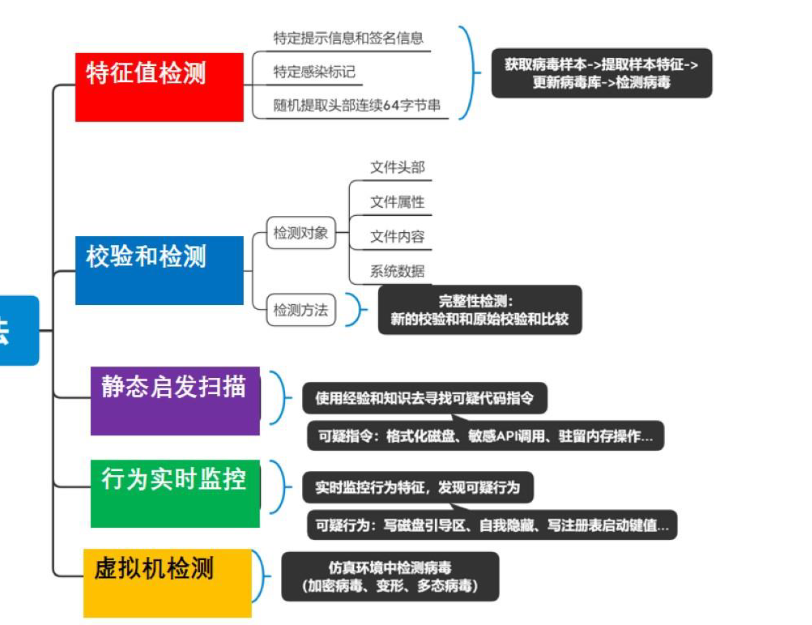

## 网络安全

DOS、ddos、synflood、land、smurf攻击的定义和特点

- DOS攻击：一种通过耗尽CPU、内存、带宽以及磁盘空间等系统资源，阻止或削弱对网络、系统或应用程序的授权使用的行为
- DDOS：多机攻击。攻击者--控制傀儡机--攻击傀儡机--被攻击主机
- Land攻击：
- synflood攻击（Syn欺骗）根据TCP的特性。伪造源地址SYN，让服务器不断重试及等待，消耗系统资源
- smurf攻击（ICMP反射攻击）使用广播请求，源地址伪造为被攻击目标的IP地址。中介网络作为放大器或者反射器，目标机器接受大量的来自中介网络的回应包。

洪泛攻击、放大攻击

- 洪泛攻击：消耗所有可用的网络资源：DDOS
- 连通性攻击：消耗掉所有可用的系统资源
- 放大攻击：smurf攻击

入侵检测技术的功能?

- 一种及时发现入侵、成功阻止黑客入侵、并在事后对入侵进行分析，查明系统漏洞并及时修补的动态网络安全技术。
  入侵:试图破坏资源的保密性、完整性、可用性的活动集合。
  入侵检测系统IDS:入侵检测的软硬件组合
- 数据来源分类
  - 基于主机的检测
  - 基础网络的检测，可以放在防火墙内外和里面
  - 混合式检测
- 分析方法分类
  - 异常检测:可能出现入侵但不异常，未入侵但异常，缺点：误报率高，实现难度大，优点：能检测未知攻击
  - 规则检测

NIDS和HIDS的特点和比较，异常入侵检测和规则入侵检测比较

- network IDS
- host IDS

IDS放在防火墙位置

1. 可以。

1. 放在外部：隔离攻击，并告

   警；

1. 放在内部：减少IDS的误报

   率，弥补防火墙放外不防内

   的缺陷。但增加了防火墙的

   性能开销。

蜜罐的概念和作用

- 一个人工构建的用于吸引、诱骗攻击者进行攻击从而获悉攻击活动的隔离环境
- 特点：部署或模拟存在漏洞的服务/应用程序、预留系统配置缺陷等引诱攻击者进行攻击、入侵和植入恶意软件尽可能模拟实际运行环境以捕获完整的攻击活动和恶意行为记录可能与恶意活动相关的文件访问、系统变更、进程创建等系统行为、网络通信、下载payload等

防火墙技术的功能?防火墙特点、防火墙的规则配置

- 防火墙: 访问控制，允许正确通信数据通过的安全设备重安全性、轻可用性路由器: 路由、数据转发，让通信数据尽可能快地传输的网络设备。重可用性、轻安全性某些场合下，路由器：可以执行防火墙的某些功能，用来完全屏蔽内部网络的IP地址
- 优点：实现集中的安全管理，防止非授权用户进入内网部署网络地址转换NAT的地点，隐藏内网结构对内网划分，实现重点网段的分离，防止安全问题的扩散审计和记录访问的最佳点。
- 缺点：用户使用的瓶颈，带来传输延迟、单点失效 不能防范内部攻击 不能防止旁路攻击 不能完全防范病毒的传播 不能防范因特网上新的威胁和攻击

简单包过滤、应用代理、状态检测包过滤防火墙的特点和机制

- 简单包过滤：网络层中进行报头过滤。
- 应用代理：在应用层进行内容过滤
- 状态检测包：

VPN技术的概念、特点以及关键技术(封装技术)

- 是构建在公用网络基础设施之上的虚拟专用网络

- 虚拟:利用Internet等公共网络资源和设备建立的逻辑线路
- 专用:只有授权用户才可使用
- 隧道技术，即封装技术，将一种协议x封装在另一种协议y中传输，实现协议x对公用网络的透明性
- 原始IP包头和数据封装后，作为乘客协议x被保护，然后在前面加上运载协议（新IP包头和IPsec包头（隧道协议y））
- 常见的隧道协议
  - 数据链路层实现封装:第二层隧道PPTP、L2F、L2TP 、MPLS 
  - 网络层隧道协议: IPSec、GRE
  - 会话层隧道协议: SOCKS5议
  - 应用层隧道协议: SSL协议
- 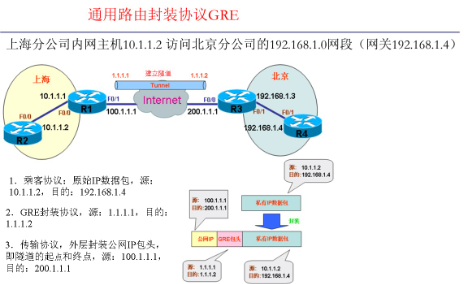
- 

## 操作系统安全

==控制数据的流动==

四种访问控制策略:自主、强制、基于角色、基于属性

军事安全策略（保护机密性）

须知原则

- 只有那些在工作中需要知道敏感数据的主题才允许访问相应的敏感数据。

安全标签

- <安全等级，分隔区> 客体-敏感 主体-许可
- 上写，主体安全等级<=客体安全等级
- 下读，主题安全等级>=客体安全等级
- 不能访问。

两种商业安全策略（保护完整性，机密性）:

- Clark-Wilson 策略
  - 用于良构事务的安全策略，通过约束实现信息的完整性。
  - 良构事务的定义和描述:
    良构事务定义:用户不能随意操纵数据，只能以受控方式操作数据，以保持或确保数据的完整性。
    三元组 <userid, TPCDI,CDI......>描述用户只能调用相应的转换程序来处理指定的受控数据项，各负其责完成事务。
- 中国墙策略
  - 商界有名的机密策略，用于有利益冲突的组织间进行访问控制。最初为投资银行设计
  - 该策略建立在三个抽象等级上:
    对象:最低级 。公司的信息或文件公司群体:与一个特定公司相关的所有对象组成。利益冲突类:最高级。相互竞争的公司的所有对象集合
  - 由主体以前的访问历史决定。从未访问，则允许任意访问一旦访问，就建立主体访问墙。允许访问墙一侧(该公司群体中其他对象)，禁止访问墙另一侧(该利益冲突类中的其他公司群体对象)
  - 补充访问控制策略:主体不允许写(即只读);或者主体的访问《读和写)都被限制在同一个公司群体中

两种安全模型
(BLP:禁止上读下写)

- 只处理机密性保护问题，不能防止或解决隐蔽通道通道，没有修改访问权限的机制

(,BIBA:允许上读下写)

隐通道概念、安全内核、引用监视器、TCB

隐通道covert channel:在不违反安全策略的基础上实现信息的非法流动和获取的通信信道

1)内核Kernel是OS的一部分，与系统安全控制相关的部分软件。是引用监视器的具体实现。

2)引用监视器:是对设备、文件、内存、进程间通信以及其他种类对象进行访问控制的所有访问控制措施的集合，是一个抽象的概念。

3)可信计算基:计算机系统内的所有保护机制的总称，包含了安全内核和其它保护机制。